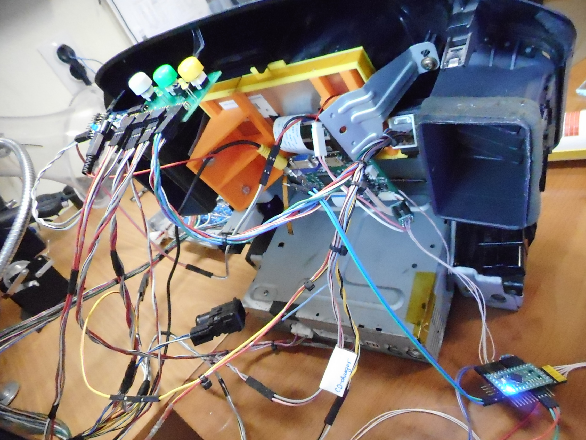

# Lexus RX300 LCD Display with Rear/Side Cameras View and Multimedia Support #

This project is an LCD display for Lexus RX300 (1998...2003). It is beeing built in order to replace the standard "blue" display in Lexus RX300 and Toyota Harrier.

  

  

----

For now this project has:

+ a complete integration with vehicle's MPX bus;
+ a complete integration with climate control and trip computer;
+ up to three analog cameras support (composite input);
+ close-to-original display view (any view can be built);
+ real time clock.

The following tasks are in progress:

* on-board player support (amplifier, radio and CD-player);
* migrating to ARM STM32 platform.

The following features could be implemented in future:

* HDMI input for Android-stick;
* independent media center with full-band radio and MP3 support.

